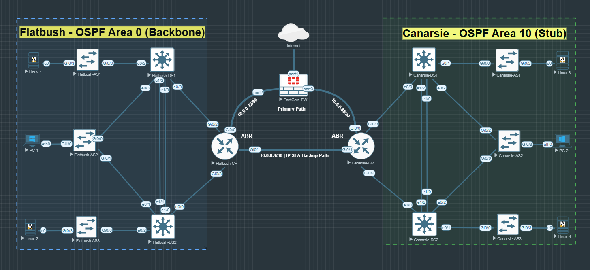

# ospf-zbf-network-lab

Dual-site enterprise network lab built in EVE-NG Pro covering OSPF multi-area, FortiGate zone-based firewall, HSRP v2, EtherChannel, IP SLA failover, and Netmiko automation.

## Topology

- **Site A — Flatbush:** OSPF Area 0 (Backbone)
- **Site B — Canarsie:** OSPF Area 10 (Stub)
- **Edge:** FortiGate firewall with 3 zones (FLATBUSH, CANARSIE, UNTRUST)

## Implementation

* FortiGate zone-based firewall with stateful inspection across 3 explicit security zones and NAT overload to internet.
* OSPF multi-area (Area 0 + Area 10) with stub area isolation, MD5 authenticated adjacencies, inter-area summarization at the ABR, and ECMP load balancing across dual uplinks.
* IP SLA failover with tracked static routes and automatic convergence on firewall failure.
* HSRP v2 with object tracking and preempt on all distribution switches.
* Passive-interface on inter-site link enforcing FortiGate as the sole routing boundary between sites.
* DHCP with centralized pools and helper-addresses forwarding across both sites.
* Extended ACLs on both core routers with centralized syslog to a dedicated Linux server.
* EtherChannel LACP configured on all distribution switches and PVST+ with root bridge set at the distribution layer.
* PortFast and BPDU Guard on all access ports, and native VLAN with DTP disabled across all trunks.
* Netmiko automation for bulk config deployment across all 12 devices.

## Device Inventory

| Device | Role | Management IP |
|---|---|---|
| FortiGate-FW | Edge Firewall — NAT | 192.168.153.130 |
| Flatbush-CR | ABR — Area 0 | 192.168.153.101 |
| Canarsie-CR | ABR — Area 10 | 192.168.153.102 |
| Flatbush-DS1 | Distribution — HSRP Active | 192.168.153.10 |
| Flatbush-DS2 | Distribution — HSRP Standby | 192.168.153.11 |
| Canarsie-DS1 | Distribution — HSRP Active | 192.168.153.20 |
| Canarsie-DS2 | Distribution — HSRP Standby | 192.168.153.21 |
| Flatbush-AS1/2/3 | Access — VLAN 10 | 192.168.153.111-113 |
| Canarsie-AS1/2/3 | Access — VLAN 50/100 | 192.168.153.221-223 |

## Configs

All device running configurations are in this repository.
